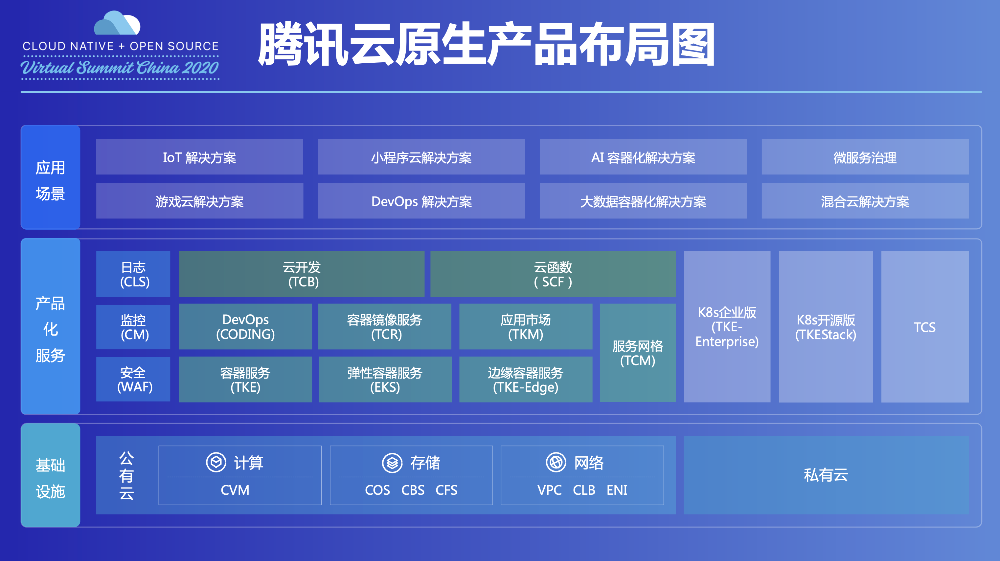
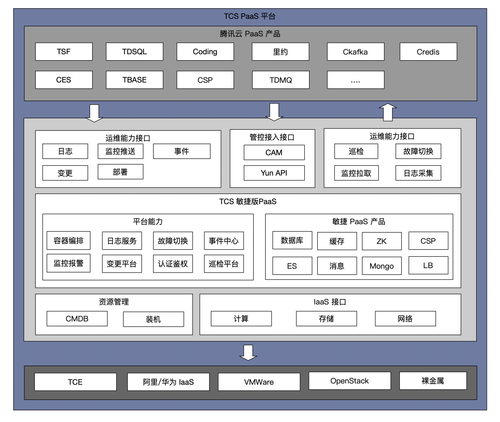
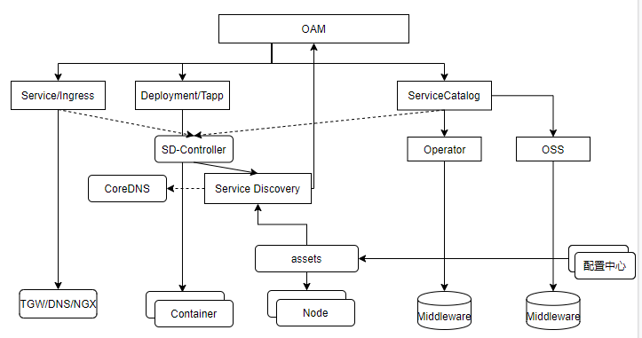
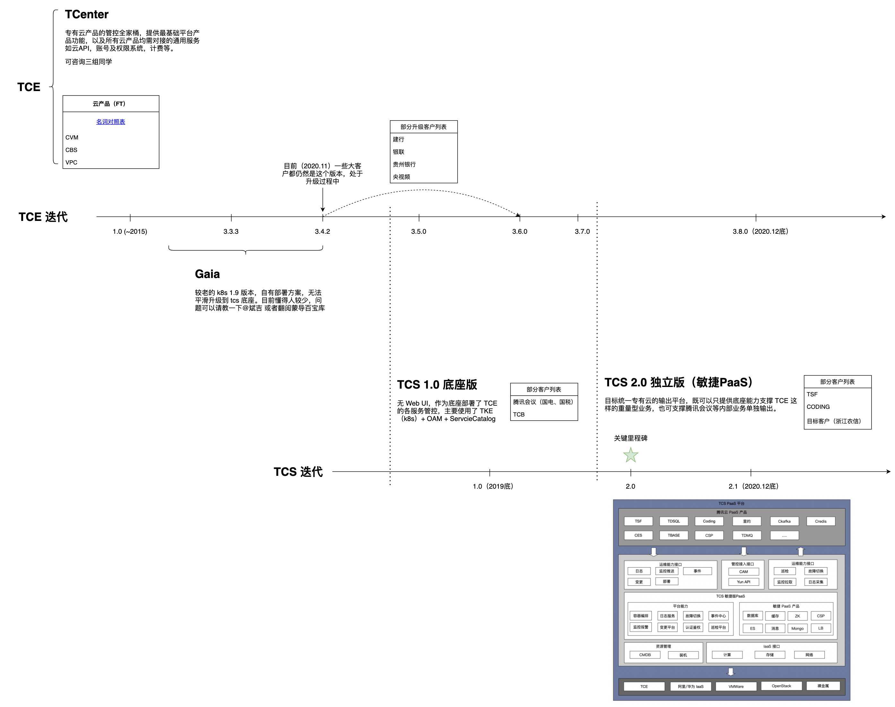

# TCS简介

## 产品概况

2020年7月31日,腾讯云副总裁刘煜宏在2020云原生技术大会上：腾讯云提供了基于云原生的企业敏捷PaaS平台TCS。平台自带多种腾讯云和业界成熟的PaaS服务组件，为私有化产品提供灵活高效的云原生基础设施。

TCS（Tencent Cloud-native Stack）被定为一款基于云原生的企业版敏捷PaaS平台。它具备：

* 从基础设置到应用全局视角的运维能力

* 开箱即用海量成熟的中间件服务

* 一分钟部署生产级业务应用

* 对异构硬件服务器及主流IaaS全面支持

* 自研基于原生K8s标准的非容器化应用调度

## 产品定位

TCS 定位是一款 Tencent 的敏捷 PaaS。TCS输出形态：

* TCS PaaS 平台版，提供腾讯云 PaaS 产品，以腾讯多样和强大的云产品技术作为依托，提供企业级 PaaS 产品解决方案，同时也包含敏捷版 PaaS 中的能力。在规划上，TCS v2.1.0 会包含 TSF、Coding、里约、TDMQ、Ckafka等。
* TCS PaaS 敏捷版，是对TCS PaaS平台的进一步轻量化裁剪，提供云原生PaaS产品，面向应用运维的理念，给到一些需要极轻量化 PaaS 产品（低配版）的客户，这个产品也作为腾讯云产品私有化底座，例如：腾讯会议、TCB，**也可作为 TCE（腾讯云私有化企业版方案）底座**。

## 产品架构

## 组件列表

参考[TCS1.0组件列表](https://docs.qq.com/sheet/DZVNrandIUWlHQWFI?tab=BB08J2)

## 参考资料

* [TCS项目简介](https://iwiki.woa.com/pages/viewpage.action?pageId=278958892)

* [TCS架构图](https://iwiki.woa.com/pages/viewpage.action?pageId=516991384)

* [容器云平台](https://iwiki.woa.com/pages/viewpage.action?pageId=516998110)
* [TCE/TCS timeline 映射关系](https://iwiki.woa.com/pages/viewpage.action?pageId=426343082)
* http://git.code.oa.com/tce-inf/
* [iWiki-专有云平台研发与工程生产力](https://iwiki.woa.com/space/PrivateCloudDevOps)

* [iWiki-专有云产品架构组](https://iwiki.woa.com/space/CSIGTCESA)
* [iWiki-TCE专有云交付研发](https://iwiki.woa.com/space/tceDeliveryDev)

