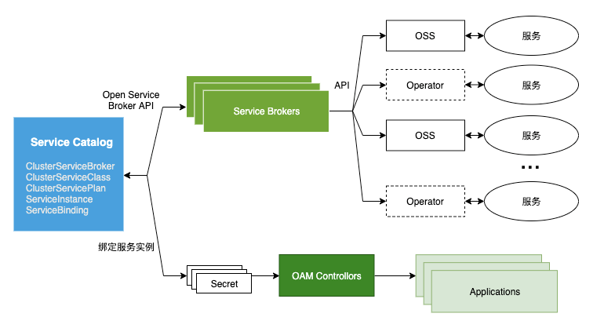

# 有状态服务管理（SSM）——TCS的ServiceCatalog实现

## 概览

SSM（Stateful Service Management）是 TCS 中管理有状态服务（中间件）的平台，目前集成了：Zookeeper、Mongo、Kafka、RabbitMQ、ETCD、TDSQL、CRedis、CES、CSP 等有状态服务。SSM是TCS对开源社区ServiceCatalog框架的一套实现。


### Open Service Broker API：云原生应用与第三方服务之间的桥梁

#### 1）Open Service Broker API因何而来？

基于以下的前提：

- 容器已经成为应用编排的事实标准；
- 当前容器应用使用云服务的方式不够优雅；

考虑一个场景：TCE某个组件要使用Credis实例。如何创建这个Credis实例？如何把密码提供给组件？如果审计要求定时修改Credis实例密码，密码变更后如何同步组件配置？


#### 2）什么是Open Service Broker API？

[Open Service Broker API](https://www.openservicebrokerapi.org/)（开放服务代理API，简称OSBAPI）是首先由CloudFoundry提出的一个第三方服务编排框架，致力于提供统一的第三方服务编排交付方式，使得云原生应用能够简单优雅的使用第三方应用。


如图：

* Open Service Broker API作为通用接口，与第三方有状态服务（图中的MySQL、RabbitMQ、Redis等）进行交付。
* 第三方有状态服务可定义不同的规则套餐（Plan）。
* 左边代表有状态服务的整个生命周期管理。


###  Service Catalog：Open Service Broker API的Kubernetes实现
Service Catalog是Open Service Broker API在Kubernetes上的一套实现框架。口号：“Binging the Cloud Back into Your Cluster”。


如图：

* Service Catalog提供ClusterServiceBroker、ClusterServiceClass、ServiceBinding等CRD资源对象。
* 应用程序（Application）通过绑定（Bind）操作与实例进行关联。
* Service Catalog通过统一个OSBAPI与ServiceBroker进行交互，完成有状态服务实例的管理。





## 核心概念
Service Catalog相关的CRD。

| 概念                 | 说明                  | 举例                                                   |
| -------------------- | --------------------- | ------------------------------------------------------ |
| ClusterServiceClass  | 第三方服务的类型      | credis、kafka、zookeeper等                             |
| ClusterServicePlan   | 第三方服务的套餐规格  | credis两种plan：standard（4G内存）、advanced（8G内存） |
| ClusterServiceBroker | 管理服务实例的API     | http://credis-broker.service-brokers.svc:8080          |
| ServiceInstance      | 服务实例配置          |                                                        |
| ServiceBinding       | 服务绑定给哪个App使用 |                                                        |


### OSB核心概念——ClusterServiceClass
**官方定义**
**ClusterServiceClass**: A managed service offered by a particular service broker. When a new ClusterServiceBroker resource is added to the cluster, the Service Catalog controller connects to the service broker to obtain a list of available managed services. It then creates a new ClusterServiceClass resource corresponding to each managed service.
**ClusterServiceClass**：由特定服务代理（service broker）提供的，受控的服务。当集群中添加一个新的ClusterServiceBroker资源时，Service Catalog controller连接service broker获取可用的受控服务列表，然后对应每个受控服务创建一个对应的ClusterServiceClass资源。
**人话**
**服务的类型**。举例，当需要redis，则ClusterServiceClass配置为credis；若需要kafka，则ClusterServiceClass配置为kafka。
TCS 1.0集群自带如下ClusterServiceClass：

```
# kubectl get ClusterServiceClass
NAME           EXTERNAL-NAME   BROKER             AGE
ces            ces             ces-broker         60d
cmq            cmq             cmq-broker         24d
credis         credis          credis-broker      60d
kafka          kafka           kafka-broker       60d
mongo          mongo           mongo-broker       60d
rabbitmq       rabbitmq        rabbitmq-broker    60d
tdsql          tdsql           tdsql-broker       60d
z7azookeeper   zookeeper       zookeeper-broker   60d
```


### OSB核心概念——ClusterServicePlan

**官方定义**

**ClusterServicePlan**: A specific offering of a managed service. For example, a managed service may have different plans available, such as a free tier or paid tier, or it may have different configuration options, such as using SSD storage or having more resources. Similar to ClusterServiceClass, when a new ClusterServiceBroker is added to the cluster, Service Catalog creates a new ClusterServicePlan resource corresponding to each Service Plan available for each managed service.

**ClusterServicePlan**：一个受控服务的特定规格。例如，一个受管服务可以有多种可用方案（如免费型/付费型），或不同的配置（如SSD存储或更多的资源）。与ClusterServiceClass类似，当集群内新增一个ClusterServiceBroker时，Service Catalog自动的为每隔受管服务创建一个对应的ClusterServicePlan资源。

**人话**

**第三方服务预先定义好的套餐规格**。举例，Credis服务有两种ClusterServicePlan，分别是advanced（8G内存master-slave双实例）和standard（4G内存单实例）。

TCS 1.0集群现有的ClusterServicePlan：

```
# kubectl get ClusterServicePlan
NAME                        EXTERNAL-NAME              BROKER             CLASS          AGE
ces-60403-clog-advanced     ces-60403-clog-advanced    ces-broker         ces            60d
ces-60403-clog-standard     ces-60403-clog-standard    ces-broker         ces            60d
ces-60403-ctsdb-advanced    ces-60403-ctsdb-advanced   ces-broker         ces            60d
ces-60403-ctsdb-standard    ces-60403-ctsdb-standard   ces-broker         ces            60d
cmq-1.0-standard            cmq-1.0-standard           cmq-broker         cmq            24d
kafka-0.9-standard          kafka-0.9-standard         kafka-broker       kafka          60d
kafka-1.1-standard          kafka-1.1-standard         kafka-broker       kafka          60d
mongo-3.6-advanced          mongo-3.6-advanced         mongo-broker       mongo          60d
mongo-3.6-standard          mongo-3.6-standard         mongo-broker       mongo          60d
rabbitmq-3.6-advanced       rabbitmq-3.6-advanced      rabbitmq-broker    rabbitmq       60d
rabbitmq-3.6-standard       rabbitmq-3.6-standard      rabbitmq-broker    rabbitmq       60d
redis-4.0-advanced          redis-4.0-advanced         credis-broker      credis         60d
redis-4.0-standard          redis-4.0-standard         credis-broker      credis         60d
tdsql-5.7-advanced          tdsql-5.7-advanced         tdsql-broker       tdsql          60d
tdsql-5.7-standard          tdsql-5.7-standard         tdsql-broker       tdsql          60d
z7azookeeper-3.4-advanced   zookeeper-3.4-advanced     zookeeper-broker   z7azookeeper   60d
z7azookeeper-3.4-standard   zookeeper-3.4-standard     zookeeper-broker   z7azookeeper   60d
```


### OSB核心概念——ClusterServiceBroker
**官方定义**
**ClusterServiceBroker**: An in-cluster representation of a service broker, encapsulating its server connection details. These are created and managed by cluster operators who wish to use that broker server to make new types of managed services available within their cluster.
**ClusterServiceBroker**：集群内对应一个service broker的资源，封装了服务器连接的细节信息。ClusterServiceBroker是由集群希望使用broker server来创建新的受控服务的operator创建和管理。

**人话**
创建或删除服务实例所调用的API，通常以K8s Service形式部署。
TCS 1.0集群中的ClusterServiceBroker：

```
# kubectl get ClusterServiceBroker
NAME               URL                                                STATUS   AGE
ces-broker         http://ces-broker.service-brokers.svc:8080         Ready    60d
cmq-broker         http://cmq-broker.service-brokers.svc:8080         Ready    24d
credis-broker      http://credis-broker.service-brokers.svc:8080      Ready    60d
kafka-broker       http://kafka-broker.service-brokers.svc:8080       Ready    60d
mongo-broker       http://mongo-broker.service-brokers.svc:8080       Ready    60d
rabbitmq-broker    http://rabbitmq-broker.service-brokers.svc:8080    Ready    60d
tdsql-broker       http://tdsql-broker.service-brokers.svc:8080       Ready    60d
zookeeper-broker   http://zookeeper-broker.service-brokers.svc:8080   Ready    60d

```

### OSB核心概念——ServiceInstance
**官方定义**
**ServiceInstance**: A provisioned instance of a ClusterServiceClass. These are created by cluster operators to make a specific instance of a managed service available for use by one or more in-cluster applications. When a new ServiceInstance resource is created, the Service Catalog controller connects to the appropriate service broker and instruct it to provision the service instance.
**ServiceInstance**：某个ClusterServiceClass预制出来的实例。ServiceInstance是集群内operator创建出来，供集群的应用使用的受管服务的特定实例。当一个ServiceInstance被创建出来，Service Catalog控制器将连接对应的service broker并指示service broker完成服务实例的预制。

**人话**
服务实例。一个ServiceInstance对应一个有状态服务的实例配置，包括是哪种服务类型（ClusterServiceClass），采用哪种规格（ClusterServicePlan）等。ServiceInstance 采用的是面向终态的声明式的语义，使用者通过一个 ServiceInstance 对象声明了要一个怎样的服务实例（例如多少副本、CPU、内存多少），SSM 会自动地保证这个实例按照要求被创建出来，使用者不用操心实例是如何部署的，在哪里部署的。同样的，因为一个 ServiceInstance 对象就是一个服务实例，删除这个对象也就相当于删除了这个服务实例，包括数据。

查看集群中的ServiceInstance：

```
# kubectl get serviceinstance -A | grep redis 
service-brokers   tdsql-credis-db                 ClusterServiceClass/tdsql       tdsql-5.7-standard         Ready    58d
tce               oam-ckv-amp                     ClusterServiceClass/credis      redis-4.0-standard         Ready    52d
tce               oam-ckv-api2                    
... ...
```


### OSB核心概念——ServiceBinding

**官方定义**
**ServiceBinding**: Access credentials to a ServiceInstance. These are created by cluster operators who want their applications to make use of a ServiceInstance. Upon creation, the Service Catalog controller creates a Kubernetes Secret containing connection details and credentials for the Service Instance, which can be mounted into Pods.
**ServiceBinding**：ServiceInstance的访问证书。ServiceBinding是由集群内希望其应用使用ServiceInstance的operator所创建。在创建时，Service Catalog控制器同时将创建一个包含ServiceInstance的连接信息和证书的K8s Secret，该Secret可挂载到pod中。

**人话**
ServiceInstance 对象会完成服务实例的创建，但是一个业务组件需要使用一个服务实例，还需要通过一个绑定动作完成，即 ServiceBinding。假设这样的一个场景，多个不同的组件需要使用同一个数据库实例，这个时候我们需要为每个组件按照需求（例如权限）创建不同的数据库账号，初始化不同的数据库表，这些操作和不同的组件相关，我们通过服务绑定（ServiceBinding）这个动作去触发这些操作。业务想要使用一个服务实例（例如 tdsql），只需要创建一个 ServiceBinding 对象绑定到一个 ServiceInstance 中，绑定的结果是得到访问数据库的连接信息（地址、端口、账号等），这些信息将被自动保存在一个 k8s secret 中（secret 名可以在 ServiceBinding 中指定）。
查看集群中的ServiceBinding：

```
# kubectl get ServiceBinding -A | grep redis 
service-brokers   tdsql-credis-db                              tdsql-credis-db                 tdsql-credis-db                              Ready    58d
tce               dbsql-redis-control-center                   oam-db.db-1                     dbsql-redis-control-center                   Ready    40d
... ...

```


## Service Catalog：Hello World

以Credis为例，说明Service Catalog的使用。
实验目标：成功创建一个ServiceInstance。

整个实例大概耗时10分钟，需要我们手动创建2个CR。
* 1个ServiceInstance
* 1个ServiceBinding

此外，Service Catalog框架会自动创建如下的CR。
* 1个Secret。该Secret保存了Credis实例的连接访问信息。
* 1个Service。该Service纳管了Credis实例。

TCS为我们自动完成了如下工作。
* 调用支撑Credis的API，完成了Credis实例的创建。
* 完成了DNS配置，将Credis实例的域名解释到Credis实例的K8s Service VIP。

### 创建ServiceInstance
首先，创建一个ServiceInstance。
```
apiVersion: servicecatalog.k8s.io/v1beta1
kind: ServiceInstance
metadata:
  name: redis-test
  namespace: test
spec:
  clusterServiceClassExternalName: credis
  clusterServicePlanExternalName: redis-4.0-standard
  updateRequests: 0
  parameters:
    pass: "admin123@."
    replicas: 1
    shards: 1
    host: redis.test.cn
    resources: 
      memory: 1G
```

其中：
* .spec.clusterServiceClassExternalName表示ServiceInstance所配置的ClusterServiceClass名字。通过命令kubectl get clusterServiceClass可查询所有可用的ClusterServiceClass。
* .spec.clusterServicePlanExternalName表示ServiceInstance配置的ClusterServicePlan名字。可以通过命令kubectl get clusterserviceplan查询所有可用的ClusterServicePlan。

观察ServiceInstance状态。

```
# kubectl get serviceinstance redis-test -n test 
NAME         CLASS                        PLAN                 STATUS   AGE
redis-test   ClusterServiceClass/credis   redis-4.0-standard   Ready    10m
```

若ServiceInstance有异常，则可通过查看ServiceInstance的事件判断原因。
```
# kubectl get events -A | grep redis-test 
test              12m         Normal    Provisioning              serviceinstance/redis-test                                     The instance is being provisioned asynchronously
test              11m         Normal    Provisioning              serviceinstance/redis-test                                     The instance is being provisioned asynchronously (Wait for ingress)
test              11m         Normal    ProvisionedSuccessfully   serviceinstance/redis-test                                     The instance was provisioned successfully
test              5m55s       Normal    InjectedBindResult        servicebinding/redis-test                                      Injected bind result

```
对于Credis类型的ServiceInstance，也可以通过查看redis-broker的log进行判断。
```
# kubectl get po -n service-brokers | grep redis
credis-broker-7cd5bdfcbf-xcq7w          1/1     Running            0          55d
credis-broker-7cd5bdfcbf-xct7b          1/1     Running            0          55d
# kubectl logs -f credis-broker-7cd5bdfcbf-xct7b -n service-brokers --tail=10 
... ...
```

### 创建ServiceBinding
创建ServiceBinding将Redis实例绑定给App。
```yaml
apiVersion: servicecatalog.k8s.io/v1beta1
kind: ServiceBinding
metadata:
  finalizers:
  - kubernetes-incubator/service-catalog
  name: redis-test
  namespace: test
spec:
  instanceRef:
    name: redis-test
  parameters:
    __service_id__: demo
  secretName: redis-test
  userInfo:
    groups:
    - system:masters
    - system:authenticated
    uid: admin
    username: admin
```

创建ServiceBinding后，会自动创建一个同名的Secret。该Secret中保存有redis实例的连接信息。
```
# kubectl get secret redis-test -n test -oyaml
apiVersion: v1
data:
  __service_id__: ZGVtbw==
  host: cmVkaXMudGVzdC5jbg==
  ipv4: MTAuMjguNDEuMTU=
  memory: MTA3Mzc0MTgyNA==
  node_list: W3siaG9zdCI6IjEwLjI4LjAuMTAiLCJwb3J0Ijo2ODA1fSx7Imhvc3QiOiIxMC4yOC4wLjExIiwicG9ydCI6OTA2OH0seyJob3N0IjoiMTAuMjguMC45IiwicG9ydCI6NjcwM31d
  params: eyJhcHBJRCI6MTYwNH0=
  pass: YWRtaW4xMjNALg==
  port: NDEwNzU=
  user: ""
kind: Secret
metadata:
  creationTimestamp: "2020-08-05T06:16:16Z"
  finalizers:
  - finalizers.infra.tce.io/sd-controller
  name: redis-test
  namespace: test
  ownerReferences:
  - apiVersion: servicecatalog.k8s.io/v1beta1
    blockOwnerDeletion: true
    controller: true
    kind: ServiceBinding
    name: redis-test
    uid: 0a399adf-e01d-45e4-b3d7-0f487dc4f8e3
  resourceVersion: "239660328"
  selfLink: /api/v1/namespaces/test/secrets/redis-test
  uid: 38a2429a-b0ad-44ac-bbb3-27bbfd7a4f7e
type: Opaque

```
创建ServiceBinding时，TCS会自动为支撑实例创建一个K8s Service。
```
# kubectl get svc credis-105f4a29-a2e3-4094-a888-1c125bf0ea78  -n service-brokers -oyaml
apiVersion: v1
kind: Service
metadata:
  annotations:
    infra.tce.io/endpoints: 10.28.0.10:6805,10.28.0.11:9068,10.28.0.9:6703
  creationTimestamp: "2020-08-05T06:10:28Z"
  finalizers:
  - service.kubernetes.io/load-balancer-cleanup
  labels:
    app.kubernetes.io/instance: 105f4a29-a2e3-4094-a888-1c125bf0ea78
    app.kubernetes.io/name: credis
  name: credis-105f4a29-a2e3-4094-a888-1c125bf0ea78
  namespace: service-brokers
  resourceVersion: "239642984"
  selfLink: /api/v1/namespaces/service-brokers/services/credis-105f4a29-a2e3-4094-a888-1c125bf0ea78
  uid: b0651192-4be9-4ae6-b0f8-0f2af9810bbb
spec:
  clusterIP: 192.168.244.70
  externalTrafficPolicy: Cluster
  ports:
  - nodePort: 40928
    port: 41075
    protocol: TCP
    targetPort: 6805
  sessionAffinity: None
  type: LoadBalancer
status:
  loadBalancer:
    ingress:
    - ip: 10.28.41.15
```
在创建ServiceBinding的同时，TCS自动为我们配置好了域名解释。
```
# nslookup redis.test.cn
Server:         192.168.192.10
Address:        192.168.192.10#53

Name:   redis.test.cn
Address: 10.28.41.15
```


**思考题：创建出来的实例，如何提供给应用程序使用？**

