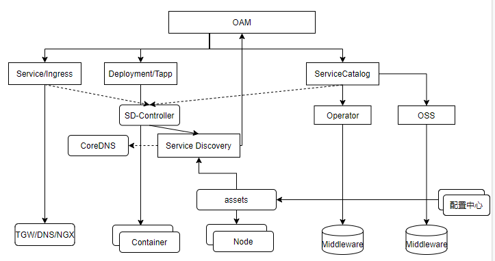
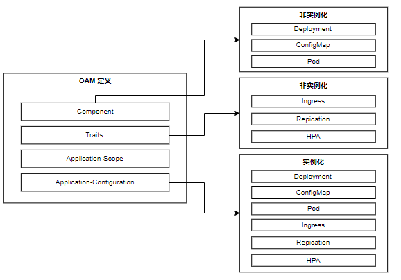
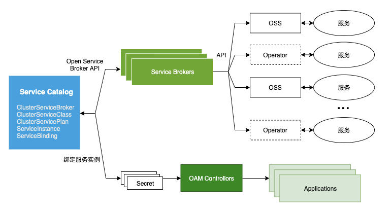

# OAM——TCS应用管理模型

## 简介

开放应用模型（OAM，Open Application Model）。TCS OAM具有如下特点。

* 容器应用与非容器应用的统一编排。应用运行引擎与k8s解耦，一套应用定义，必须可以不加修改跑到不同运行环境当中，无论是不是基于 K8s，这是解决我们在应用交付时所遇到的问题的关键。做到“一次定义、随处运行”。
* 关注点分离。根据CNCF对DevOps的定义，将CI/CD过程中的人群分为三类：Infrastructure Operator、Application Operator和Application Developer；并针对三类人群设置不同的管理对象定义。
* 声明式定义。

TCS 1.0 OAM整体架构。





## 核心对象

TCS OAM核心的对象包括：

* Component：定义应用组件及其配置文件，对应Deployment、ConfigMap。
* Traits：定义应用运维操作，对应Ingress、Scale。
* ApplicationScope：定义应用的逻辑范围，在k8s里没有对应对象。【TCE360基本无使用】
* ApplicationConfiguration： 将上述对象关联部署，对应上述对象的运行态实例。






## OAM：Hello World

下面创建一个简单的OAM应用的Demo。

### 创建OAM资源对象

#### 创建Namespace

````yaml
apiVersion: v1
kind: Namespace
metadata:
  name: pg-allenscmo  # 修改为各自ID
````


#### 创建Config

声明配置文件。（在TCE真实环境，Config中信息来源于配置中心）

```yaml
apiVersion: infra.tce.io/v1alpha1
kind: Config
metadata:
  name: app-config
  namespace: pg-allenscmo  # 修改为各自ID
spec:
  base: "{\"test1\":\"test1\"}"
  provide: "{\"test2\":\"test2\"}"
  private: "{\"test3\":\"test3\"}"
```


#### 创建Components

声明TDSQL的Component。

```yaml
apiVersion: infra.tce.io/v1alpha1
kind: Component
metadata:
  name: app-tdsql
  namespace: pg-allenscmo  # 修改为各自ID
spec:
  workloadType: infra.tce.io/v1alpha1/Middleware
  workloadSettings:
    - name: middleware/class
      type: string
      default: tdsql   #不需要修改
    - name: middleware/plan
      type: string
      default: tdsql-5.7-standard  #规格，可按需修改
    - name: middleware/service-id
      type: string
      default: app-sql  #服务ID，在容器组件依赖声明时使用
    - name: middleware/group
      type: string
      default: db-1     #实例名，用于多个中间件声明共享一个实例
```


声明容器业务Component，依赖TDSQL服务。

```yaml
apiVersion: infra.tce.io/v1alpha1
kind: Component
metadata:
  name: app-comp-1
  namespace: pg-allenscmo  # 修改为各自ID
spec:
  workloadType: infra.tce.io/v1alpha1/Deployment
  dependencies:
    - dependencyName: db   # 容器内配置文件引用的别名
      serviceID: app-sql   # 依赖的服务ID，由提供方声明
  config:
    - path: /data/local.json
      name: app-config     # 配置模板名称
  containers:
    - name: app-comp-1
      image: registry.tce.com/ina/hello-world:1.0
      ports:
        - name: http
          port: 80
```


#### 创建 Application

声明应用，集成Components。

```yaml
apiVersion: infra.tce.io/v1alpha1
kind: Configuration
metadata:
  name: app
  namespace: pg-allenscmo  # 修改为各自ID
spec:
  components:
    - componentName: app-tdsql
      instanceName: app-tdsql
    - componentName: app-comp-1
      instanceName: app-comp-1
      parameterValues:
        - name: image
          value: registry.tce.com/tce/nginx
      traits:
        - traitType: infra.tce.io/v1alpha1/Network
          network:
            id: app-comp-1
            targetPort: 80
            host: app.tce.io
            protocol: http
            underlay: true
```

创建资源对象。

```
kubectl apply -f  oam.yaml
```


### 检查应用状态

#### 检查App

```yaml
# kubectl describe app app 
Name:         app
Namespace:    default
Labels:       <none>
Annotations:  kubectl.kubernetes.io/last-applied-configuration:
                {"apiVersion":"infra.tce.io/v1alpha1","kind":"Configuration","metadata":{"annotations":{},"name":"app","namespace":"default"},"spec":{"com...
API Version:  infra.tce.io/v1alpha1
Kind:         Configuration
Metadata:
  Creation Timestamp:  2021-01-18T22:08:29Z
  Finalizers:
    oam.finalizers.infra.tce.io
  Generation:        4
  Resource Version:  975165024
  Self Link:         /apis/infra.tce.io/v1alpha1/namespaces/default/configurations/app
  UID:               c8a7ec1f-5097-4016-a126-5c01307040b6
Spec:
  Components:
    Component Name:  app-tdsql
    Instance Name:   app-tdsql
    Component Name:  app-comp-1
    Instance Name:   app-comp-1
    Parameter Values:
      Name:   image
      Value:  registry.tce.com/tce/nginx
    Traits:
      Network:
        Host:         app.tce.io
        Id:           app-comp-1
        Protocol:     http
        Target Port:  80
        Underlay:     true
      Trait Type:     infra.tce.io/v1alpha1/Network
Status:
  Conditions:
    Last Transition Time:  2021-01-18T22:57:33Z
    Last Update Time:      2021-01-18T22:57:33Z
    Message:               some components not ready
    Reason:                ComponentsNotReady
    Status:                False
    Type:                  Ready
  Module Count:            6
  Modules:
    Group Version:  servicecatalog.k8s.io/v1beta1
    Kind:           ServiceBinding
    Name:           default/app-tdsql
    Status:         Ready
    Group Version:  infra.tce.io/v1
    Kind:           ServiceInit
    Name:           default/app-tdsql
    Status:         Failed
    Group Version:  extensions/v1beta1
    Kind:           Ingress
    Name:           default/u-app-comp-1
    Status:         Ready
    Group Version:  v1
    Kind:           Service
    Name:           default/u-app-comp-1
    Status:         Ready
    Group Version:  infra.tce.io/v1alpha1
    Kind:           Config
    Name:           default/app-config
    Status:         Ready
    Group Version:  apps/v1
    Kind:           Deployment
    Name:           default/app-comp-1
    Status:         Ready
  Phase:            Progressing
  Ready Count:      5
Events:
  Type    Reason            Age    From  Message
  ----    ------            ----   ----  -------
  Normal  SuccessfulCreate  48m    App   succeed to create svcInstance oam-db-1
  Normal  SuccessfulCreate  48m    App   succeed to create service u-app-comp-1
  Normal  SuccessfulCreate  48m    App   succeed to create ingress u-app-comp-1
  Normal  SuccessfulCreate  48m    App   succeed to create deploy app-comp-1
  Normal  SuccessfulUpdate  46m    App   succeed to update svcInstance oam-db-1
  Normal  SuccessfulUpdate  46m    App   succeed to update deploy app-comp-1
  Normal  SuccessfulUpdate  44m    App   succeed to update svcInstance oam-db-1
  Normal  SuccessfulUpdate  44m    App   succeed to update deploy app-comp-1
  Normal  SuccessfulUpdate  43m    App   succeed to update svcInstance oam-db-1
  Normal  SuccessfulUpdate  43m    App   succeed to update deploy app-comp-1
  Normal  SuccessfulUpdate  41m    App   succeed to update svcInstance oam-db-1
  Normal  SuccessfulUpdate  41m    App   succeed to update deploy app-comp-1
  Normal  SuccessfulUpdate  39m    App   succeed to update svcInstance oam-db-1
  Normal  SuccessfulCreate  39m    App   succeed to create svcBinding app-tdsql
  Normal  SuccessfulUpdate  39m    App   succeed to update deploy app-comp-1
  Normal  SuccessfulUpdate  37m    App   succeed to update svcInstance oam-db-1
  Normal  SuccessfulUpdate  37m    App   succeed to update binding app-tdsql
```

检查对应的Service。

```yaml
# kubectl get svc u-app-comp-1  -oyaml 
apiVersion: v1
kind: Service
metadata:
  annotations:
    infra.tce.io/current-spec: '{"ports":[{"protocol":"TCP","port":80,"targetPort":80}],"selector":{"infra.tce.io/oam-app":"app","infra.tce.io/oam-comp":"app-comp-1"},"type":"ClusterIP","sessionAffinity":"None"}'
    infra.tce.io/ted.service-id: app-comp-1
    infra.tce.io/underlay: "false"
  creationTimestamp: "2021-01-18T22:10:11Z"
  labels:
    infra.tce.io/oam-app: app
    infra.tce.io/oam-comp: app-comp-1
    infra.tce.io/oam-trait: u-app-comp-1
  name: u-app-comp-1
  namespace: default
  ownerReferences:
  - apiVersion: infra.tce.io/v1alpha1
    blockOwnerDeletion: true
    controller: true
    kind: Configuration
    name: app
    uid: c8a7ec1f-5097-4016-a126-5c01307040b6
  resourceVersion: "975019027"
  selfLink: /api/v1/namespaces/default/services/u-app-comp-1
  uid: c21990dd-4c86-47e8-94dc-09e8f075c364
spec:
  clusterIP: 192.168.251.48
  ports:
  - port: 80
    protocol: TCP
    targetPort: 80
  selector:
    infra.tce.io/oam-app: app
    infra.tce.io/oam-comp: app-comp-1
  sessionAffinity: None
  type: ClusterIP
status:
  loadBalancer: {}
```

尝试访问。

```
# curl http://192.168.251.48:80
<!DOCTYPE html>
<html>
<head>
<title>Welcome to nginx!</title>
<style>
    body {
        width: 35em;
        margin: 0 auto;
        font-family: Tahoma, Verdana, Arial, sans-serif;
    }
</style>
</head>
<body>
...
```


#### 检查Component


```
# kubectl describe component app-comp-1  
Name:         app-comp-1
Namespace:    default
Labels:       <none>
Annotations:  kubectl.kubernetes.io/last-applied-configuration:
                {"apiVersion":"infra.tce.io/v1alpha1","kind":"Component","metadata":{"annotations":{},"name":"app-comp-1","namespace":"default"},"spec":{"...
API Version:  infra.tce.io/v1alpha1
Kind:         Component
Metadata:
  Creation Timestamp:  2021-01-18T22:08:29Z
  Finalizers:
    oam.finalizers.infra.tce.io
  Generation:        3
  Resource Version:  975084520
  Self Link:         /apis/infra.tce.io/v1alpha1/namespaces/default/components/app-comp-1
  UID:               20434ad4-ba3b-4173-a909-0d00019d2c18
Spec:
  Config:
    Name:  app-config
    Path:  /data/local.json
  Containers:
    Image:  registry.tce.com/ina/hello-world:1.0
    Name:   app-comp-1
    Ports:
      Name:  http
      Port:  80
  Dependencies:
    Dependency Name:  db
    Service ID:       app-sql
  Metadata:
    Creation Timestamp:  <nil>
  Workload Type:         infra.tce.io/v1alpha1/Deployment
Status:
  Ready For Build:  true
Events:             <none>


# kubectl describe component app-tdsql  
Name:         app-tdsql
Namespace:    default
Labels:       <none>
Annotations:  kubectl.kubernetes.io/last-applied-configuration:
                {"apiVersion":"infra.tce.io/v1alpha1","kind":"Component","metadata":{"annotations":{},"name":"app-tdsql","namespace":"default"},"spec":{"w...
API Version:  infra.tce.io/v1alpha1
Kind:         Component
Metadata:
  Creation Timestamp:  2021-01-18T22:08:29Z
  Finalizers:
    oam.finalizers.infra.tce.io
  Generation:        2
  Resource Version:  975026352
  Self Link:         /apis/infra.tce.io/v1alpha1/namespaces/default/components/app-tdsql
  UID:               b1e5dec6-90a8-470a-bde9-f97a9e87e7b7
Spec:
  Metadata:
    Creation Timestamp:  <nil>
  Workload Settings:
    Default:      tdsql
    Name:         middleware/class
    Type:         string
    Default:      tdsql-5.7-standard
    Name:         middleware/plan
    Type:         string
    Default:      app-sql
    Name:         middleware/service-id
    Type:         string
    Default:      db-1
    Name:         middleware/group
    Type:         string
  Workload Type:  infra.tce.io/v1alpha1/Middleware
Status:
  Ready For Build:  true
Events:             <none>
```


#### 检查ServiceInstance/ServiceBinding

检查对应的ServiceInstance状态。

```yaml
# kubectl describe serviceinstance  oam-db-1  
Name:         oam-db-1
Namespace:    default
Labels:       servicecatalog.k8s.io/spec.clusterServiceClassRef.name=9de44748bfa79db17ad70e63b0d27e6ddccdaf66a3223c3f7bdf4394
              servicecatalog.k8s.io/spec.clusterServicePlanRef.name=c2110adb6c6864e48dcd2f0987cd93b13f76b66d106cbc9e9289d751
Annotations:  infra.tce.io/current-spec:
                {"clusterServiceClassExternalName":"tdsql","clusterServicePlanExternalName":"tdsql-5.7-standard","parameters":{},"externalID":"oam-db-1","...
API Version:  servicecatalog.k8s.io/v1beta1
Kind:         ServiceInstance
Metadata:
  Creation Timestamp:  2021-01-18T22:10:11Z
  Finalizers:
    kubernetes-incubator/service-catalog
  Generation:        2
  Resource Version:  975044270
  Self Link:         /apis/servicecatalog.k8s.io/v1beta1/namespaces/default/serviceinstances/oam-db-1
  UID:               0cac5129-b7cc-4fa1-9cdb-879cbf255bbf
Spec:
  Cluster Service Class External Name:  tdsql
  Cluster Service Class Ref:
    Name:                              tdsql
  Cluster Service Plan External Name:  tdsql-5.7-standard
  Cluster Service Plan Ref:
    Name:       tdsql-5.7-standard
  External ID:  oam-db-1
  Parameters:
  Update Requests:  0
  User Info:
    Groups:
      system:serviceaccounts
      system:serviceaccounts:service-catalog
      system:authenticated
    UID:       decf7e39-45a5-4810-9bfd-b1773fe16c72
    Username:  system:serviceaccount:service-catalog:service-catalog-controller-manager
Status:
  Async Op In Progress:  false
  Conditions:
    Last Transition Time:  2021-01-18T22:18:35Z
    Message:               The instance was provisioned successfully
    Reason:                ProvisionedSuccessfully
    Status:                True
    Type:                  Ready
  Deprovision Status:      Required
  External Properties:
    Cluster Service Plan External ID:    tdsql-5.7-standard
    Cluster Service Plan External Name:  tdsql-5.7-standard
    User Info:
      Groups:
        system:serviceaccounts
        system:serviceaccounts:service-catalog
        system:authenticated
      UID:                        decf7e39-45a5-4810-9bfd-b1773fe16c72
      Username:                   system:serviceaccount:service-catalog:service-catalog-controller-manager
  Last Condition State:           Ready
  Observed Generation:            2
  Orphan Mitigation In Progress:  false
  Provision Status:               Provisioned
  Reconciled Generation:          2
  User Specified Class Name:      ClusterServiceClass/tdsql
  User Specified Plan Name:       tdsql-5.7-standard
Events:
  Type    Reason                   Age   From                                Message
  ----    ------                   ----  ----                                -------
  Normal  Provisioning             37m   service-catalog-controller-manager  The instance is being provisioned asynchronously
  Normal  Provisioning             30m   service-catalog-controller-manager  The instance is being provisioned asynchronously (Wait for ingress)
  Normal  ProvisionedSuccessfully  28m   service-catalog-controller-manager  The instance was provisioned successfully
```


检查ServiceBinding状态。

```yaml
 kubectl get servicebinding app-tdsql  -oyaml 
apiVersion: servicecatalog.k8s.io/v1beta1
kind: ServiceBinding
metadata:
  annotations:
    infra.tce.io/current-spec: '{"instanceRef":{"name":"oam-db-1"},"parameters":{"__service_id__":"app-sql"},"externalID":"app-tdsql"}'
    infra.tce.io/service-id: app-sql
    infra.tce.io/used-apps: app
  creationTimestamp: "2021-01-18T22:18:45Z"
  finalizers:
  - kubernetes-incubator/service-catalog
  generation: 1
  labels:
    infra.tce.io/oam-app: app
  name: app-tdsql
  namespace: default
  resourceVersion: "975050288"
  selfLink: /apis/servicecatalog.k8s.io/v1beta1/namespaces/default/servicebindings/app-tdsql
  uid: c56362cf-86ae-4942-844b-3bab69906957
spec:
  externalID: app-tdsql
  instanceRef:
    name: oam-db-1
  parameters:
    __service_id__: app-sql
  secretName: app-tdsql
  userInfo:
    groups:
    - system:serviceaccounts
    - system:serviceaccounts:tcs-system
    - system:authenticated
    uid: e8733a22-ed0a-4e50-8b14-e51c231d4ad4
    username: system:serviceaccount:tcs-system:oam
status:
  asyncOpInProgress: false
  conditions:
  - lastTransitionTime: "2021-01-18T22:18:47Z"
    message: Injected bind result
    reason: InjectedBindResult
    status: "True"
    type: Ready
  externalProperties:
    parameterChecksum: 93a024f5aadc7bb1947beda6878faef3037b363a87001fd6e4a93c3ad3ae891f
    parameters:
      __service_id__: app-sql
    userInfo:
      groups:
      - system:serviceaccounts
      - system:serviceaccounts:tcs-system
      - system:authenticated
      uid: e8733a22-ed0a-4e50-8b14-e51c231d4ad4
      username: system:serviceaccount:tcs-system:oam
  lastConditionState: Ready
  orphanMitigationInProgress: false
  reconciledGeneration: 1
  unbindStatus: Required
```


检查Secret状态，对Secret中的data进行base64解码可获得实例的连接信息。

```yaml
# kubectl get secret app-tdsql  -oyaml 
apiVersion: v1
data:
  __service_id__: YXBwLXNxbA==
  db_name_list: bnVsbA==
  host: bjlxOXk1a3cudGRzcWwuaW5mcmEudGNlLmlv   # base64 decode: n9q9y5kw.tdsql.infra.tce.io
  ipv4: MTAuMjguNDEuMTQ=       # base64 decode: 10.28.41.14
  node_list: W3siaG9zdCI6IjEwLjI4LjAuMTAiLCJwb3J0IjoxNTAxM30seyJob3N0IjoiMTAuMjguMC4xMSIsInBvcnQiOjE1MDEzfSx7Imhvc3QiOiIxMC4yOC4wLjkiLCJwb3J0IjoxNTAxM31d
  pass: YXhscXhlOG5oajBx
  port: Mzc4Njk=
  user: eG54cjA5cmd4MHB5
kind: Secret
metadata:
  creationTimestamp: "2021-01-18T22:18:47Z"
  finalizers:
  - finalizers.infra.tce.io/sd-controller
  name: app-tdsql
  namespace: default
  ownerReferences:
  - apiVersion: servicecatalog.k8s.io/v1beta1
    blockOwnerDeletion: true
    controller: true
    kind: ServiceBinding
    name: app-tdsql
    uid: c56362cf-86ae-4942-844b-3bab69906957
  resourceVersion: "975045058"
  selfLink: /api/v1/namespaces/default/secrets/app-tdsql
  uid: 5d4644f7-e62c-4c93-ba84-05ddd7318242
type: Opaque
```


检查TDSQL实例的Service状态。

```yaml
# kubectl get svc  tdsql-oam-db-1 -n service-brokers  -oyaml
apiVersion: v1
kind: Service
metadata:
  annotations:
    infra.tce.io/endpoints: 10.28.0.10:15013,10.28.0.11:15013,10.28.0.9:15013
  creationTimestamp: "2021-01-18T22:16:19Z"
  finalizers:
  - service.kubernetes.io/load-balancer-cleanup
  labels:
    app.kubernetes.io/instance: oam-db-1
    app.kubernetes.io/name: tdsql
  name: tdsql-oam-db-1
  namespace: service-brokers
  resourceVersion: "975038034"
  selfLink: /api/v1/namespaces/service-brokers/services/tdsql-oam-db-1
  uid: 291abcab-84e8-4cee-b670-187128546ea7
spec:
  clusterIP: 192.168.215.30
  externalTrafficPolicy: Cluster
  ports:
  - nodePort: 60256
    port: 37869
    protocol: TCP
    targetPort: 15013
  sessionAffinity: None
  type: LoadBalancer
status:
  loadBalancer:
    ingress:
    - ip: 10.28.41.14
```


尝试解析实例的域名。

```
# nslookup n9q9y5kw.tdsql.infra.tce.io
Server:         192.168.192.10
Address:        192.168.192.10#53

Name:   n9q9y5kw.tdsql.infra.tce.io
Address: 10.28.41.14

# curl -X GET 127.0.0.1:30150/api/v1alpha1/service/instances?host=n9q9y5kw.tdsql.infra.tce.io | python -mjson.tool
[
    {
        "cluster": "02c3fcd9-95b4-4d10-97a7-396a2be9f103",
        "endpoint": {
            "host": "n9q9y5kw.tdsql.infra.tce.io",
            "ip": "10.28.41.14",
            "port": "37869"
        },
        "instanceID": "app-sql-47277942-682b-4392-93c7-f30118d55834",
        "labels": {
            "endpoint.host": "n9q9y5kw.tdsql.infra.tce.io",
            "kind": "Secret",
            "level": "default",
            "name": "app-tdsql",
            "namespace": "default",
            "spec.cluster": "02c3fcd9-95b4-4d10-97a7-396a2be9f103",
            "spec.instance-id": "app-sql-47277942-682b-4392-93c7-f30118d55834",
            "spec.region": "50000001",
            "spec.service-id": "app-sql",
            "spec.underlay": "true",
            "spec.zone": "0"
        },
        "lastUpdateTime": "2021-01-18T22:23:01Z",
        "rawData": {
            "raw": "eyJfX3NlcnZpY2VfaWRfXyI6ImFwcC1zcWwiLCJkYl9uYW1lX2xpc3QiOm51bGwsImhvc3QiOiJuOXE5eTVrdy50ZHNxbC5pbmZyYS50Y2UuaW8iLCJpcHY0IjoiMTAuMjguNDEuMTQiLCJub2RlX2xpc3QiOlt7Imhvc3QiOiIxMC4yOC4wLjEwIiwicG9ydCI6MTUwMTN9LHsiaG9zdCI6IjEwLjI4LjAuMTEiLCJwb3J0IjoxNTAxM30seyJob3N0IjoiMTAuMjguMC45IiwicG9ydCI6MTUwMTN9XSwicGFzcyI6ImF4bHF4ZThuaGowcSIsInBvcnQiOjM3ODY5LCJ1c2VyIjoieG54cjA5cmd4MHB5In0="
        },
        "region": "50000001",
        "serviceID": "app-sql",
        "underlay": true,
        "zone": "0"
    }
]
```


检查tdsql-broker的log，查找与我们创建的ServiceInstance相关的log。

```
I0118 22:10:11.692329       1 logic.go:59] Provision service
I0118 22:10:11.699523       1 logic.go:176] Selected machine: Y0-MI52-25G
I0118 22:10:11.699551       1 logic.go:223] Check whether there are enough resources available
I0118 22:10:11.702756       1 logic.go:246] Host 10.28.0.11 available resources: CPU 27.0 core, Memory 117000 M, Data Disk 80000 M, Log Disk 157000 M
I0118 22:10:11.702774       1 logic.go:246] Host 10.28.0.10 available resources: CPU 27.0 core, Memory 117000 M, Data Disk 80000 M, Log Disk 157000 M
I0118 22:10:11.702782       1 logic.go:246] Host 10.28.0.9 available resources: CPU 27.0 core, Memory 117000 M, Data Disk 80000 M, Log Disk 157000 M
I0118 22:10:11.702789       1 logic.go:264] Available resources seems enough for the request
I0118 22:10:11.707119       1 logic.go:283] Submit instance creation to oss with task id: 70
I0118 22:10:11.712884       1 logic.go:315] Asynchronously provision oam-db-1 with key: provision/oam-db-1::70:tdsql1
I0118 22:10:12.827170       1 logic.go:417] To get latest status of instance oam-db-1, operation key: provision/oam-db-1::70:tdsql1
I0118 22:10:12.831992       1 provision.go:89] Instance provision process: 10
I0118 22:10:13.321676       1 logic.go:48] Get catalog
I0118 22:10:14.891798       1 logic.go:417] To get latest status of instance oam-db-1, operation key: provision/oam-db-1::70:tdsql1
I0118 22:10:14.895113       1 provision.go:89] Instance provision process: 10
I0118 22:10:17.909277       1 logic.go:48] Get catalog
I0118 22:10:18.896003       1 logic.go:417] To get latest status of instance oam-db-1, operation key: provision/oam-db-1::70:tdsql1
I0118 22:10:18.899119       1 provision.go:89] Instance provision process: 10
I0118 22:10:23.321730       1 logic.go:48] Get catalog
I0118 22:10:26.899827       1 logic.go:417] To get latest status of instance oam-db-1, operation key: provision/oam-db-1::70:tdsql1
I0118 22:10:26.933599       1 provision.go:89] Instance provision process: 10
I0118 22:11:14.998217       1 logic.go:417] To get latest status of instance oam-db-1, operation key: provision/oam-db-1::70:tdsql1
I0118 22:11:15.001371       1 provision.go:89] Instance provision process: 70
I0118 22:16:19.591829       1 logic.go:417] To get latest status of instance oam-db-1, operation key: provision/oam-db-1::70:tdsql1
I0118 22:16:19.596472       1 provision.go:159] Instance init process: 100
I0118 22:16:19.607118       1 logic.go:501] Ensure k8s service/endpoints created
I0118 22:16:19.616230       1 k8s.go:99] K8s service tdsql-oam-db-1 created
I0118 22:16:19.616250       1 logic.go:523] Wait for ingress ready
I0118 22:16:22.616382       1 logic.go:501] Ensure k8s service/endpoints created
I0118 22:16:22.616434       1 logic.go:523] Wait for ingress ready
I0118 22:16:23.321733       1 logic.go:48] Get catalog
I0118 22:16:25.616527       1 logic.go:501] Ensure k8s service/endpoints created
I0118 22:16:25.616572       1 logic.go:523] Wait for ingress ready
I0118 22:16:27.909185       1 logic.go:48] Get catalog
I0118 22:16:28.616686       1 logic.go:501] Ensure k8s service/endpoints created
I0118 22:16:28.616759       1 logic.go:523] Wait for ingress ready
I0118 22:16:31.616868       1 logic.go:501] Ensure k8s service/endpoints created
I0118 22:16:31.616939       1 logic.go:523] Wait for ingress ready
I0118 22:18:34.992302       1 logic.go:417] To get latest status of instance oam-db-1, operation key: provision/oam-db-1::70:tdsql1
I0118 22:18:34.992392       1 logic.go:501] Ensure k8s service/endpoints created
I0118 22:18:34.992415       1 logic.go:517] Ingress ready
I0118 22:18:34.992423       1 logic.go:537] Ingress ready, vip: 10.28.41.14
I0118 22:18:45.805215       1 logic.go:621] Binding to instance oam-db-1, binding id: app-tdsql
I0118 22:18:45.805278       1 manager.go:165] no bindings found for instance oam-db-1
I0118 22:18:45.810107       1 oss.go:60] User creation task submitted for user 'xnxr09rgx0py'
I0118 22:18:45.813023       1 oss.go:40] Task 1406 is running
I0118 22:18:46.816077       1 logic.go:764] Grant global permissions to user xnxr09rgx0py as no db list specified
I0118 22:18:46.823888       1 oss.go:40] Task 1407 is running
I0118 22:18:47.826869       1 logic.go:773] Grand global permissions to user 'xnxr09rgx0py' succeeded
I0118 22:18:47.827261       1 manager.go:184] Add binding app-tdsql to instance oam-db-1 in store
I0118 22:18:47.830797       1 manager.go:220] Add binding app-tdsql to store successfully
I0118 22:18:47.830813       1 logic.go:802] Binding app-tdsql for instance oam-db-1 saved to store
```


#### 检查Config

```
# kubectl describe  cfg app-config   
Name:         app-config
Namespace:    default
Labels:       <none>
Annotations:  kubectl.kubernetes.io/last-applied-configuration:
                {"apiVersion":"infra.tce.io/v1alpha1","kind":"Config","metadata":{"annotations":{},"name":"app-config","namespace":"default"},"spec":{"bas...
API Version:  infra.tce.io/v1alpha1
Kind:         Config
Metadata:
  Creation Timestamp:  2021-01-18T22:08:29Z
  Finalizers:
    oam.finalizers.infra.tce.io
  Generation:        2
  Resource Version:  975045828
  Self Link:         /apis/infra.tce.io/v1alpha1/namespaces/default/configs/app-config
  UID:               7dff4039-215e-4676-b5eb-c8efc7477f66
Spec:
  Base:  {"test1":"test1"}
  Dependencies:
    Dependency Name:  db
    Service ID:       app-sql
  Private:            {"test2":"test2"}
  Provide:            {"test3":"test3"}
Status:
  Conditions:
    Last Transition Time:  2021-01-18T22:19:00Z
    Last Update Time:      2021-01-18T22:19:00Z
    Message:               config Ready
    Status:                True
    Type:                  Ready
  Dependency Count:        1
  Phase:                   Ready
  Ready Count:             1
  Services:
    Alias:             db
    Last Update Time:  2021-01-18T22:19:00Z
    Service ID:        app-sql
    Status:            Ready
Events:
  Type    Reason                 Age                 From    Message
  ----    ------                 ----                ----    -------
  Normal  SuccessfulCreate       51m                 Config  succeed to create cm app-config
  Normal  AllDependencyReady     41m                 Config  all dependencies ready for con app-config
  Normal  ApplyConfigMapSuccess  60s (x53 over 51m)  Config  conf app-config apply to cm success
```


#### 检查ConfigMap和配置挂载

```yaml
# kubectl get cm app-config -oyaml
apiVersion: v1
data:
  local.json: |-
    {
      "base": {
        "test1": "test1"
      },
      "private": {
        "test2": "test2"
      },
      "provide": {
        "test3": "test3"
      },
      "service": {
        "db": {
          "__service_id__": "app-sql",
          "db_name_list": null,
          "host": "n9q9y5kw.tdsql.infra.tce.io",
          "ipv4": "10.28.41.14",
          "node_list": [
            {
              "host": "10.28.0.10",
              "port": 15013
            },
            {
              "host": "10.28.0.11",
              "port": 15013
            },
            {
              "host": "10.28.0.9",
              "port": 15013
            }
          ],
          "pass": "axlqxe8nhj0q",
          "port": 37869,
          "user": "xnxr09rgx0py"
        }
      }
    }
kind: ConfigMap
metadata:
  annotations:
    infra.tce.io/current-md5: 1da3a1b529b1d519b8a4b289da59c8cf
  creationTimestamp: "2021-01-18T22:09:20Z"
  name: app-config
  namespace: default
  ownerReferences:
  - apiVersion: infra.tce.io/v1alpha1
    blockOwnerDeletion: true
    controller: true
    kind: Config
    name: app-config
    uid: 7dff4039-215e-4676-b5eb-c8efc7477f66
  resourceVersion: "975045825"
  selfLink: /api/v1/namespaces/default/configmaps/app-config
  uid: 94a778e6-d92d-43bb-b71f-60187bcb63fb
```

进入pod内，检查以ConfigMap方式挂载进来的配置文件。

```
# kubectl exec -it app-comp-1-5b6666bdbb-jk5ln  bash 
# 以下操作在pod内
# cd /tce/conf/cm
# cat local.json 
{
  "base": {
    "test1": "test1"
  },
  "private": {
    "test2": "test2"
  },
  "provide": {
    "test3": "test3"
  },
  "service": {
    "db": {
      "__service_id__": "app-sql",
      "db_name_list": null,
      "host": "n9q9y5kw.tdsql.infra.tce.io",
      "ipv4": "10.28.41.14",
      "node_list": [
        {
          "host": "10.28.0.10",
          "port": 15013
        },
        {
          "host": "10.28.0.11",
          "port": 15013
        },
        {
          "host": "10.28.0.9",
          "port": 15013
        }
      ],
      "pass": "axlqxe8nhj0q",
      "port": 37869,
      "user": "xnxr09rgx0py"
    }
  }
}
```


## 参考资料

* 【腾讯文档】TCS应用接入手册 https://docs.qq.com/doc/DVFZzR25UTllWcmVZ
* 更新组件dbsql http://tapd.oa.com/OneBank/markdown_wikis/show/#1210130691000541585