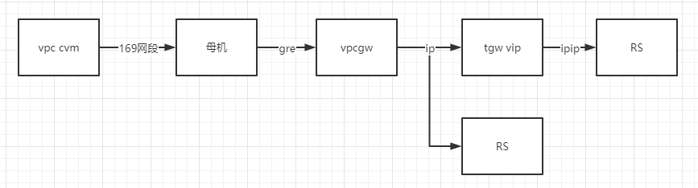
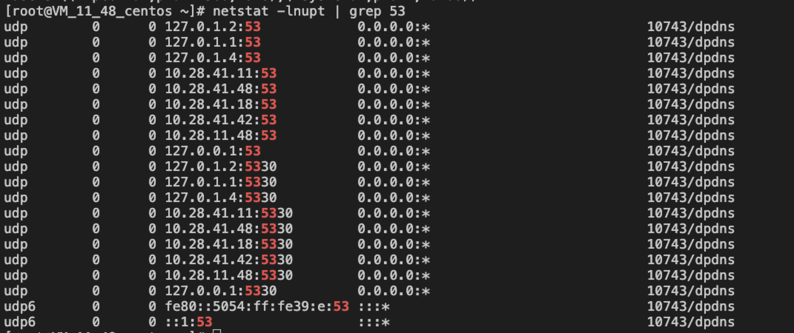

# 4. TCS网络问题排查专题


## LVS切换TGW

文档：

* 【腾讯文档】LVS - TGW 切换 VIP 同步 https://docs.qq.com/doc/DWE1GWldBeEN4bkh3
* 【腾讯文档】350底座配置更新为TGW的VIP https://docs.qq.com/doc/DT3pnY0VCS2JHUUxE
* 【腾讯文档】更换Service的TGW VIP https://docs.qq.com/doc/DRFlUbmthbWVIdk5w


## vpcservice：管理VPC访问underlay的VPCGW网络规则

### 简介

vpcservice-controller对vpcservice对象进行LIST-WATCH，依据vpcservice的配置维护着全局的VPCGW规则。

当VPC中的CVM需要访问物理网络underlay的服务（如YUM源、DNS、NTP、COS等），则需要通过VPCGW打通VPC和underlay两个网络平面。

VPCGW规则可以简单理解为四层的LB规则。在TCE里，由于VPCGW进行监控检查的探测机原因，VPCGW后面一般再挂TGW用做健康检查。而个别使用了VPCGW特殊封包的（如product-vpcdns产品，需要开启toa等特性，VPCGW会在传输层包头增加自定义的option放置vmip/vpcid等信息，这种情况下VPCGW规则后面不能挂TGW）




### 从问题出发

**案例**：CVM同事反馈VPC子机上无法访问Barad上报消息的域名（custommessage.tcloud-barad-nws.shanghai.yf-m17.tcecqpoc.fsphere.cn），怀疑TCS vpcservice不正常。


####  排查步骤1：Overlay CVM上检查域名解析

登录一台overlay子机，解析一个underlay域名（这里是custommessage.tcloud-barad-nws.shanghai.yf-m17.tcecqpoc.fsphere.cn）。

```shell
# nslookup custommessage.tcloud-barad-nws.shanghai.yf-m17.tcecqpoc.fsphere.cn
Server:         183.60.83.19
Address:        183.60.83.19#53

Name:   custommessage.tcloud-barad-nws.shanghai.yf-m17.tcecqpoc.fsphere.cn
Address: 169.254.0.5
```

域名解析到VIP 169.254.0.5，这是一个VPCGW规则VIP。根据VIP，可在db_tvpc库t_route表中可找到对应VPCGW规则。

```shell
MySQL [db_tvpc]> select * from t_route where vip='169.254.0.5';
+-------+-----------+-------+-------------+-------+--------------+-------+--------------------+--------+--------+-----------+---------+---------------------+---------------------+
| vpcId | uniqVpcId | proto | vip         | vport | pip          | pport | bAutoActualMachine | weight | zoneId | udpOption | hostIp  | createTime          | updateTime          |
+-------+-----------+-------+-------------+-------+--------------+-------+--------------------+--------+--------+-----------+---------+---------------------+---------------------+
|    -1 | vpc_-1    | tcp   | 169.254.0.5 |    80 | 10.28.41.210 |    80 |                  1 |     16 |      0 |         0 | 0.0.0.0 | 2020-09-03 19:40:15 | 2020-09-03 19:40:15 |
+-------+-----------+-------+-------------+-------+--------------+-------+--------------------+--------+--------+-----------+---------+---------------------+---------------------+
1 row in set (0.00 sec)
```


#### 排查步骤2：检查vpcservice关联的VPCGW和TGW规则

根据VIP和VPORT，可找到对应的vpcservice。


```yaml
# kubectl get vpcservice o-tcloud-barad-nws-tce-custommessage -n tce -oyaml 
apiVersion: infra.tce.io/v1
kind: VPCService
metadata:
  annotations:
    "80": '[{"pip":"10.28.41.210","pport":80}]' 
    infra.tce.io/service-vpc-info: |-
      {
        "__scope__": "region"
      }
    infra.tce.io/ted.service-id: tcloud-barad-nws.customMessage
    infra.tce.io/underlay: "false"
  finalizers:
  - finalizers.infra.tce.io/vpcservice-controller
  labels:
    infra.tce.io/oam-app: tcloud-barad-nws
    infra.tce.io/oam-comp: tcloud-barad-nws
    infra.tce.io/oam-trait: o-tcloud-barad-nws-tce-custommessage
  name: o-tcloud-barad-nws-tce-custommessage
  namespace: tce
  ownerReferences:
  - apiVersion: infra.tce.io/v1alpha1
    blockOwnerDeletion: true
    controller: true
    kind: Configuration
    name: tcloud-barad-nws
    uid: ef88b29e-d3ab-486d-8280-b285eab1a1ca
serviceName: vpcservice-o-tcloud-barad-nws-tce-custommessage
spec:
  ports:
  - port: 80
    protocol: TCP
    targetPort: 8880     # pod监听端口，生成对应Service所需
  selector:       # selector，生成对应Service所需
    infra.tce.io/oam-app: tcloud-barad-nws
    infra.tce.io/oam-comp: tcloud-barad-nws
  vpcid: -1
  vpcip: 169.254.0.5           
status: Ready
```


其中，vpcip（169.254.0.5）即VPCGW规则VIP；annotations中有TGW规则VIP和VPORT；spec中port是TGW VPORT，targetPort为pod监听端口。该VPCService（o-tcloud-barad-nws-tce-custommessage）是控制器根据tcloud-barad-nws的Configuration自动创建。vpcservice-controller根据VPCService的内容，自动更新VPCGW规则。


再找到对应的vpcservice-开头的K8s Service（关联TGW规则）。

```yaml
# kubectl get svc vpcservice-o-tcloud-barad-nws-tce-custommessage -n tce -oyaml 
apiVersion: v1
kind: Service
metadata:
  annotations:
    "80": '[{"pip":"10.28.41.210","pport":80}]'
    infra.tce.io/service-vpc-info: |-
      {
        "__scope__": "region"
      }
    infra.tce.io/ted.service-id: tcloud-barad-nws.customMessage
    infra.tce.io/underlay: "false"
    infra.tce.io/vpc-service: o-tcloud-barad-nws-tce-custommessage
  finalizers:
  - finalizers.infra.tce.io/vpcservice-controller
  - service.kubernetes.io/load-balancer-cleanup
  name: vpcservice-o-tcloud-barad-nws-tce-custommessage
  namespace: tce
  ownerReferences:
  - apiVersion: infra.tce.io/v1
    blockOwnerDeletion: true
    controller: true
    kind: VPCService
    name: o-tcloud-barad-nws-tce-custommessage
    uid: d13166a3-7d35-422b-9d7a-226a9370ea0c
spec:
  clusterIP: 192.168.216.37
  externalTrafficPolicy: Cluster
  ports:
  - nodePort: 39422
    port: 80
    protocol: TCP
    targetPort: 8880
  selector:               # 根据selector，该Service后端为tcloud-barad-nws的pod
    infra.tce.io/oam-app: tcloud-barad-nws
    infra.tce.io/oam-comp: tcloud-barad-nws
  sessionAffinity: None
  type: LoadBalancer
status:
  loadBalancer:
    ingress:
    - ip: 10.28.41.210     # TGW VIP
```

该Service（vpcservice-o-tcloud-barad-nws-tce-custommessage）是Loadbalancer类型，由控制器根据VPCService（o-tcloud-barad-nws-tce-custommessage）自动创建，该与TGW规则相关联。tce-cloud-provider根据该Service信息，与TGW规则进行同步。


#### 排查步骤3：如果VPCGW和TGW规则都有，则转VPCGW侧和TGW侧排查

略。。。


#### 排查步骤4：如果VPC子机DNS解析失败，排查DNS解析链路

VPC虚机解析underlay服务域名的流程：

1）CVM内nameserver指向默认的VIP（183开头）。

2）对nameserver VIP的访问，会匹配到一条VPCGW规则，该VPCGW规则的后端是部署dpdns的Underlay CVM。

3）dpdns将域名请求转发给ocloud-tcenter-base-vpc-dns的TGW VIP。

4）ocloud-tcenter-base-vpc-dns完成域名解析。


**1）检查VPC子机上nameserver配置**

首先找一台VPC CVM，在宿主机上virsh console进入VPC虚拟机。

在VPC虚拟机上尝试解析域名。

```
# nslookup product-cvm-metadata.shanghai.yf-m17.tcecqpoc.fsphere.cn
Server:         183.60.83.19
Address:        183.60.83.19#53

** server can't find product-cvm-metadata.shanghai.yf-m17.tcecqpoc.fsphere.cn: SERVFAIL
```

检查VPC虚拟机的nameserver配置。
```
# cat /etc/resolv.conf 
#options timeout:1 rotate
#; generated by /usr/sbin/dhclient-script
nameserver 183.60.83.19
nameserver 183.60.82.98
```

根据nameserver的VPCGW VIP（183.60.83.19和183.60.82.98），在db_tvpc数据库中找到对应的VPCGW规则。

```
MySQL [db_tvpc]> select * from t_route where vip='183.60.83.19' or vip='183.60.82.98';
+-------+--------------+-------+--------------+-------+-------------+-------+--------------------+--------+--------+-----------+---------+---------------------+---------------------+
| vpcId | uniqVpcId    | proto | vip          | vport | pip         | pport | bAutoActualMachine | weight | zoneId | udpOption | hostIp  | createTime          | updateTime          |
+-------+--------------+-------+--------------+-------+-------------+-------+--------------------+--------+--------+-----------+---------+---------------------+---------------------+
|    -1 | vpc_-1       | udp   | 183.60.82.98 |    53 | 10.28.41.12 |    53 |                  1 |     16 |      0 |         0 | 0.0.0.0 | 2020-12-17 20:12:26 | 2020-12-17 20:12:26 |
|    -1 | vpc_-1       | udp   | 183.60.83.19 |    53 | 10.28.41.12 |    53 |                  1 |     16 |      0 |         0 | 0.0.0.0 | 2020-12-17 21:42:04 | 2020-12-17 21:42:04 |
| 67287 | vpc-hy3vate5 | udp   | 183.60.83.19 |    53 | 10.28.41.12 |    53 |                  0 |     16 |      0 |         0 | 0.0.0.0 | 2020-08-17 23:24:21 | 2020-08-17 23:24:21 |
+-------+--------------+-------+--------------+-------+-------------+-------+--------------------+--------+--------+-----------+---------+---------------------+---------------------+
3 rows in set (0.01 sec)
```

pip字段是部署dpdns的Underlay CVM。在运营端VPCDNS也可找到部署dpdns的Underlay CVM，可进行比对确认。


**2）dpdns：将域名解析请求转给ocloud-tcenter-base-vpc-dns**
登录部署dpdns的Underlay CVM，登录检查dpdns进程和53端口。



在/usr/local/services/data/dpdns/etc/forward.conf中可以找到dns的转发配置。这里看到forward.conf该域名转给10.28.41.12这个dns服务。

```
# cat /usr/local/services/data/dpdns/etc/forward.conf | grep product-cvm 
0.0.0.0/0       product-cvm-metadata.shanghai.yf-m17.tcecqpoc.fsphere.cn.   10.28.41.12         1
```

该DNS服务对应一个K8s Service和TGW规则。

```
# kubectl get svc -A |grep 10.28.41.12 | grep 53 
tce                 ocloud-tcenter-base-vpc-dns-lb-10-28-41-24                 LoadBalancer   192.168.197.182   10.28.41.12      53:54573/UDP      194d
```

Service的后端是镜像组件ocloud-tcenter-base-vpc-dns。

```
# kubectl describe svc ocloud-tcenter-base-vpc-dns-lb-10-28-41-24 -n tce 
Name:                     ocloud-tcenter-base-vpc-dns-lb-10-28-41-24
Namespace:                tce
Labels:                   infra.tce.io/oam-app=ocloud-tcenter-base-vpc-dns
                          infra.tce.io/oam-comp=ocloud-tcenter-base-vpc-dns
                          infra.tce.io/oam-trait=ocloud-tcenter-base-vpc-dns-lb-10-28-41-24
Annotations:              infra.tce.io/current-spec:
                            {"ports":[{"name":"495abdf7e766f9","protocol":"UDP","port":53,"targetPort":53}],"selector":{"app":"ocloud-tcenter-base-vpc-dns","module":"...
                          infra.tce.io/service-id:
                            [
                              {
                                "id": "ocloud-tcenter-base-vpc-dns",
                                "host": "ocloud-tcenter-base-vpc-dns.yfm17.shanghai.yf-m17.tcecqpoc.fsphere.cn",
                                "underlay": true,
                                "port": 53,
                                "ip": "10.28.41.24",
                                "protocol": "udp",
                                "zone_id": 50010001,
                                "__scope__": "zone"
                              }
                            ]
Selector:                 app=ocloud-tcenter-base-vpc-dns,module=ocloud-tcenter
Type:                     LoadBalancer
IP:                       192.168.197.182
LoadBalancer Ingress:     10.28.41.12
Port:                     495abdf7e766f9  53/UDP
TargetPort:               53/UDP
NodePort:                 495abdf7e766f9  54573/UDP
Endpoints:                192.168.4.170:53
Session Affinity:         None
External Traffic Policy:  Cluster
Events:                   <none>
```

**ocloud-tcenter-base-vpc-dns：将域名解析成VPCGW VIP**
进入**ocloud-tcenter-base-vpc-dns内**，检查53端口和unbound进程。

```
# netstat -lnupt | grep 53 
tcp        0      0 0.0.0.0:53              0.0.0.0:*               LISTEN      59/unbound          
tcp        0      0 127.0.0.1:8953          0.0.0.0:*               LISTEN      59/unbound          
udp        0      0 0.0.0.0:53              0.0.0.0:*                           59/unbound  
```

正常情况下，unbound进程在运行，且监听53端口。

在/etc/unbound/local.d/domain.conf下找到对应的规则。（规则来自配置包）
```
 # cat /etc/unbound/local.d/domain.conf | grep product-cvm-metadata
local-data: "product-cvm-metadata.shanghai.yf-m17.tcecqpoc.fsphere.cn. 3600 IN A 169.254.0.23"
```

这里``169.254.0.23``即VPC子机DNS查询应该返回的IP。


参考资料：

* 【腾讯文档】TCS容器集群和基础组件运维手册 https://docs.qq.com/doc/DUkVPbFZuWFZvS1V1